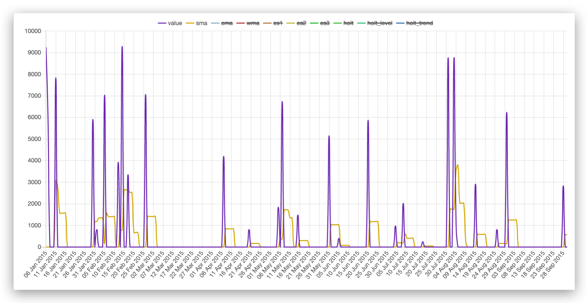

Multi Value Dimension
=====================

This module allows load a line graph per ordered pair in a x2many field.

Usage
=====

Use this widget by saying::

  <field name="field_text_json" widget="json_graph" />

Use of widget example::

  <field name="values_data" widget="json_graph"/>

Generate JSON example::

    options = {
    "value": {"borderColor": "rgba(127, 63, 191, 1)", "pointStyle":"line"},
    "sma": {"borderColor": "rgba(220,180,0,1)", "pointStyle":"line"},
    "cma": {"borderColor": "rgba(151,187,205,1)", "pointStyle":"line"},
    "wma": {"borderColor": "rgba(191, 63, 63,1)", "pointStyle":"line"},
    "es1": {"borderColor": "rgba(191, 127, 63,1)", "pointStyle":"line"},
    "es2": {"borderColor": "rgba(191, 191, 63,1)", "pointStyle":"line"},
    "es3": {"borderColor": "rgba(27, 191, 63,1)", "pointStyle":"line"},
    "holt": {"borderColor": "rgba(63, 191, 63,1)", "pointStyle":"line"},
    "holt_level": {"borderColor": "rgba(63, 191, 127,1)", "pointStyle":"line"},
    "holt_trend": {"borderColor": "rgba(63, 127, 191,1)", "pointStyle":"line"},
    }
    data_ids = forecast.value_ids
    labels = data_ids.mapped("label")
    info = {
    "type": "line",
    "data": {
      "datasets": [
        {
          **{
            "type": "line",
            "label": field,
            "data": data_ids.mapped(field),
            "borderWidth": 2,
            "lineTension": 0.5,
            "fill": False,
          },
            **option,
        }
          for field, option in list(options.items())
      ],
      "labels": labels if all(labels) else data_ids.mapped("sequence"),
    },
    "options": {
      "scales": {"yAxes": [{"ticks": {"beginAtZero": True, "stacked": False}}]},
      "elements": {"point": {"radius": 0}},
      "legend": {"labels": {"usePointStyle": True}},
    },
  }

  forecast.values_data = json.dumps(info)

Known issues / Roadmap
======================

- Nothing by the way

Bug Tracker
===========

Bugs are tracked on `GitHub Issues <https://github.com/OCA/web/issues>`_.
In case of trouble, please check there if your issue has already been reported.
If you spotted it first, help us smashing it by providing a detailed and welcomed feedback
`here <https://github.com/OCA/web/issues/new?body=module:%20web_widget_x2many_2d_graph%0Aversion:%208.0%0A%0A**Steps%20to%20reproduce**%0A-%20...%0A%0A**Current%20behavior**%0A%0A**Expected%20behavior**>`_.

Credits
=======

Contributors
------------

* Francisco Javier Vega <javier@vauxoo.com>
* Francisco Javier Luna Vázquez <fluna@vauxoo.com>

Maintainer
----------

.. image:: http://odoo-community.org/logo.png
    :alt: Odoo Community Association
    :target: http://odoo-community.org

This module is maintained by the OCA.

OCA, or the Odoo Community Association, is a nonprofit organization whose mission is to support the collaborative development of Odoo features and promote its widespread use.

To contribute to this module, please visit http://odoo-community.org.
